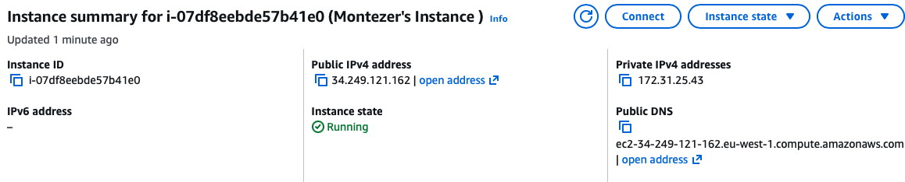
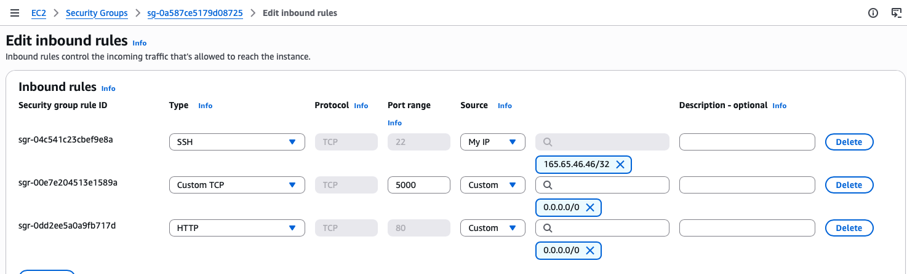
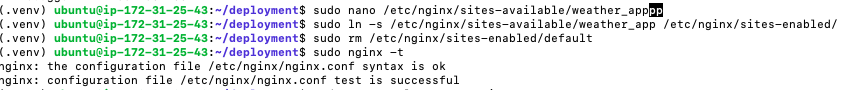
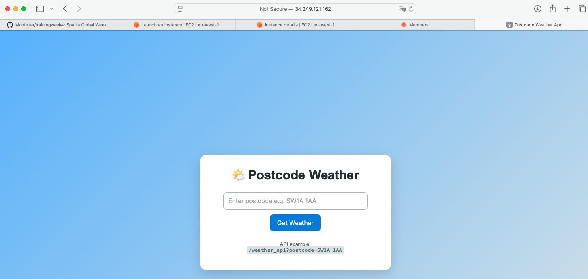

# Deployment of Flask Weather Application

## Project Overview

This project deploys a Flask application to an AWS EC2 instance.

The Flask application accepts a UK postcode and returns the current weather for that postcode. It uses:

- **Postcodes.io API** to convert a postcode into latitude and longitude
- **OpenWeather API** to retrieve weather data using latitude and longitude
- **Flask** to serve the web application and API
- **Nginx** as a reverse proxy
- **Ubuntu 24.04** on a **t3.micro EC2 instance**

The final deployed application can be accessed through the browser using the EC2 public IPv4 address.

---

# 1. Launch EC2 Instance

## Instance Details

- Cloud provider: AWS
- Instance type: `t3.micro`
- Operating system: Ubuntu Server 24.04
- Access method: SSH
- Web server: Nginx
- Application framework: Flask

## Security Group Rules

The following inbound rules were configured:

| Type | Port | Source | Purpose |
|---|---:|---|---|
| SSH | 22 | My IP | Allows secure access to the VM |
| HTTP | 80 | 0.0.0.0/0 | Allows users to access the app through Nginx |
| Custom TCP | 5000 | My IP / Temporary | Used for testing Flask directly before Nginx |

Port `5000` was used temporarily to test the Flask app directly. Once Nginx was configured successfully, users accessed the app through port `80`.

---

# 2. Copy Source Code to the VM

The Flask application folder was copied from the local machine to the EC2 instance using `scp`.

Example command:

```
scp -i ~/.ssh/montezer-tech610-key.pem -r ~/Documents/SpartGlobal/trainingweek4/thursday02july/deployment ubuntu@108.129.194.93:~
```

# 3. SSH Into the VM

After copying the source code, SSH into the EC2 instance:

```
ssh -i ~/.ssh/montezer-tech610-key.pem ubuntu@108.129.194.93
```

Then move into the deployment directory:

```
cd deployment
```

Check that the files copied correctly:

```
ls
```

Expected project structure:

```
deployment/
├── app.py
├── config.py
├── templates/
│   └── index.html
└── .gitignore
```

---

# 4. Install Required Dependencies

The VM does not automatically have the same packages as the local machine. Therefore, the required system packages need to be installed again on the server.

```
sudo apt update -y
sudo apt install python3-pip python3-venv nginx -y
```

These packages are needed because:

| Package | Purpose |
|---|---|
| `python3-pip` | Allows Python packages to be installed |
| `python3-venv` | Allows a virtual environment to be created |
| `nginx` | Used as a reverse proxy for the Flask app |

---

# 5. Create a Virtual Environment

Inside the `deployment` directory, create a virtual environment:

```
python3 -m venv .venv
```

Activate the virtual environment:

```
source .venv/bin/activate
```

Once activated, the terminal should show:

```
(.venv) ubuntu@ip-address:~/deployment$
```

---

# 6. Install Python Packages

Install the Python packages required by the Flask application:

```
pip install flask requests
```

These are needed because:

| Package | Purpose |
|---|---|
| `flask` | Runs the web application |
| `requests` | Allows the app to make API requests to Postcodes.io and OpenWeather |

---

# 7. Configure Flask to Run on the VM

By default, Flask may only run locally on the VM using `127.0.0.1`.

To allow external access during testing, edit `app.py`:

```
nano app.py
```

At the bottom of the file, change:

```
app.run(debug=True)
```

to:

```
app.run(host="0.0.0.0", port=5000, debug=True)
```

This allows the Flask application to listen for connections from outside the VM.

Save and exit nano:

```
CTRL + O
Enter
CTRL + X
```

---

# 8. Test Flask Directly

Run the Flask app:

```
python app.py
```

Expected output:

```
Running on http://0.0.0.0:5000
```

The app can then be tested in the browser using:

```
http://PUBLIC_IP:5000
```

```

At this point, the Flask app is working directly on port `5000`.

```

# 9. Configure Nginx as a Reverse Proxy

The goal is to allow users to access the Flask app through normal HTTP traffic on port `80`.

Without Nginx:

```
Browser → EC2 Public IP:5000 → Flask
```

With Nginx:

```
Browser → EC2 Public IP:80 → Nginx → Flask on port 5000
```

This means users can visit:

```
http://PUBLIC_IP
```

instead of:

```
http://PUBLIC_IP:5000
```

---

## Create Nginx Configuration File

Create a new Nginx configuration file:

```bash
sudo nano /etc/nginx/sites-available/weather_app
```

Add the following configuration:

```nginx
server {
    listen 80;
    server_name _;

    location / {
        proxy_pass http://127.0.0.1:5000;

        proxy_set_header Host $host;
        proxy_set_header X-Real-IP $remote_addr;
        proxy_set_header X-Forwarded-For $proxy_add_x_forwarded_for;
        proxy_set_header X-Forwarded-Proto $scheme;
    }
}
```

Save and exit:

```
CTRL + O
Enter
CTRL + X
```

---

## Enable the Nginx Configuration

Create a symbolic link from `sites-available` to `sites-enabled`:

```
sudo ln -s /etc/nginx/sites-available/weather_app /etc/nginx/sites-enabled/
```

Remove the default Nginx site to avoid conflicts:

```
sudo rm /etc/nginx/sites-enabled/default
```

Test the Nginx configuration:

```
sudo nginx -t
```

Restart Nginx:

```
sudo systemctl restart nginx
```

Enable Nginx so it starts automatically when the VM starts:

```
sudo systemctl enable nginx
```

---

# 10. Test the Application Through Nginx

With Flask still running on port `5000`, visit:

```
http://PUBLIC_IP
```

The Flask weather application should now load without needing to include `:5000` in the URL.

---

# 12. Screenshots

## EC2 Instance Running





## Security Group Rules




## Nginx Reverse Proxy Working on Port 80





## Weather App Frontend




